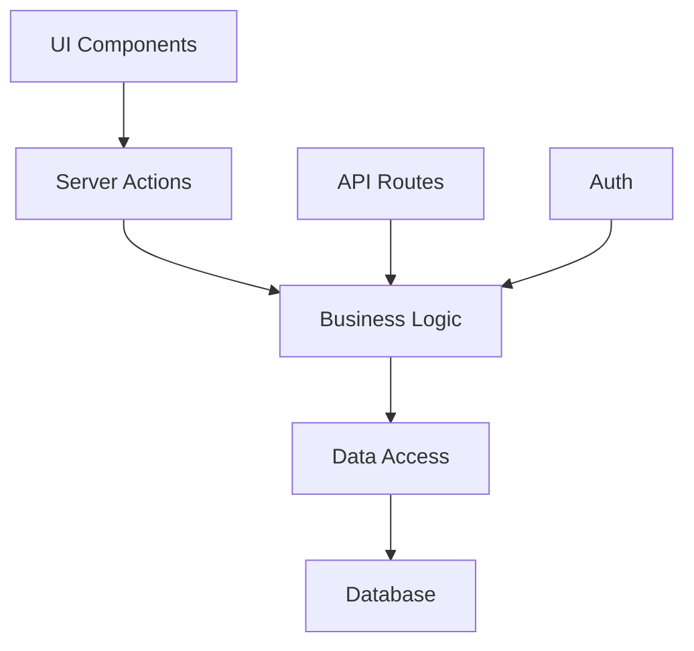

# Talently Architecture

## Overview

Talently is a talent management and booking platform built with Next.js, MongoDB, and TypeScript. The application follows a modular architecture with clear separation of concerns.

## Architecture Layers

### 1. Presentation Layer (UI)
- `src/app/*`: Next.js app router pages
- `src/components/*`: Reusable React components
  - `ui/`: Base UI components
  - `forms/`: Form-specific components
  - `layouts/`: Layout components
  - `shared/`: Shared components

### 2. Business Logic Layer
- `src/lib/`: Core business logic
  - `actions/`: Server actions for data mutations
  - `data/`: Data access and transformation
  - `validation/`: Form and data validation
  - `utils/`: Utility functions

### 3. Data Access Layer
- `src/lib/db/`: Database configuration and models
- `src/lib/api/`: API routes and handlers
- `src/lib/services/`: External service integrations

### 4. Infrastructure Layer
- `src/lib/config/`: Configuration management
- `src/lib/monitoring/`: Logging and monitoring
- `src/lib/security/`: Authentication and authorization

## Data Flow

1. Client Request → Next.js Page/Component
2. Component → Server Action/API Route
3. Server Action → Business Logic
4. Business Logic → Data Access Layer
5. Data Access Layer → Database
6. Response flows back through the layers

## Key Technologies

- **Framework**: Next.js 13 (App Router)
- **Database**: MongoDB with Mongoose
- **Authentication**: NextAuth.js
- **UI Components**: Radix UI + Tailwind CSS
- **Form Handling**: React Hook Form + Zod
- **State Management**: React Server Components + Server Actions

## Security

- JWT-based authentication
- Server-side session management
- Input validation and sanitization
- CSRF protection
- Rate limiting

## Performance Optimizations

- Server Components for reduced client-side JS
- Optimized database queries with indexes
- Image optimization
- Edge caching where applicable
- Lazy loading of components

## Monitoring and Error Handling

- Structured logging with severity levels
- Error boundaries for graceful degradation
- Performance monitoring
- Automated error reporting

## Testing Strategy

- Unit tests with Jest
- Integration tests with React Testing Library
- E2E tests with Playwright
- API tests with Supertest

## Deployment

- Vercel for hosting
- MongoDB Atlas for database
- Environment-based configuration
- Automated deployments via GitHub Actions

## Future Considerations

1. **Scalability**
   - Implement caching layer (Redis)
   - Add read replicas for database
   - Consider microservices architecture

2. **Features**
   - Real-time notifications
   - Advanced search
   - Analytics dashboard
   - Payment integration

3. **Infrastructure**
   - Container orchestration
   - CDN integration
   - Multi-region deployment

## Directory Structure

```
src/
├── app/                 # Next.js pages
├── components/          # React components
├── lib/                 # Core business logic
│   ├── actions/        # Server actions
│   ├── api/            # API routes
│   ├── db/             # Database
│   ├── services/       # External services
│   └── utils/          # Utilities
├── types/              # TypeScript types
└── styles/             # Global styles
```

## Module Dependencies



## Best Practices

1. **Code Organization**
   - Follow feature-based organization
   - Keep components small and focused
   - Use TypeScript for type safety

2. **State Management**
   - Prefer server state when possible
   - Use client state sparingly
   - Implement optimistic updates

3. **Error Handling**
   - Use error boundaries
   - Implement retry mechanisms
   - Log errors with context

4. **Performance**
   - Implement proper caching
   - Optimize images and assets
   - Monitor bundle size

## Contributing

See [CONTRIBUTING.md](./CONTRIBUTING.md) for detailed guidelines on:
- Code style
- Pull request process
- Testing requirements
- Documentation standards 